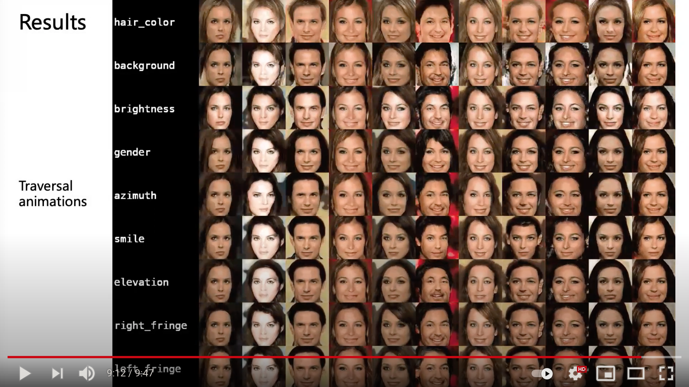

## Abstract

Latent traversal is a popular approach to visualize the disentangled latent 
representations. Given a bunch of variations in a single unit of the latent 
representation, it is expected that there is a change in a single factor of 
variation of the data while others are fixed. However, this impressive 
experimental observation is rarely explicitly encoded in the objective 
function of learning disentangled representations. This paper defines the 
variation predictability of latent disentangled representations. Given 
image pairs generated by latent codes varying in a single dimension, 
this varied dimension could be closely correlated with these image 
pairs if the representation is well disentangled. Within an adversarial 
generation process, we encourage variation predictability by maximizing the 
mutual information between latent variations and corresponding image pairs. 
We further develop an evaluation metric that does not rely on the 
ground-truth generative factors to measure the disentanglement of latent 
representations. The proposed variation predictability is a general constraint 
that is applicable to the VAE and GAN frameworks for boosting 
disentanglement of latent representations. Experiments show that the proposed 
variation predictability correlates well with existing ground-truth-required 
metrics and the proposed algorithm is effective for disentanglement learning.

## Model Architecture


## Video Presentation
[](https://youtu.be/vdOIgOuAO5Y)

## Links

[Paper](https://arxiv.org/abs/2007.12885)

[Supplementary](../files/eccv20_supp.pdf)

[Code](https://github.com/zhuxinqimac/stylegan2vp)

## Citation
```
@inproceedings{VPdis_eccv20,
author={Xinqi Zhu and Chang Xu and Dacheng Tao},
title={Learning Disentangled Representations with Latent Variation Predictability},
booktitle={ECCV},
year={2020}
}
```
