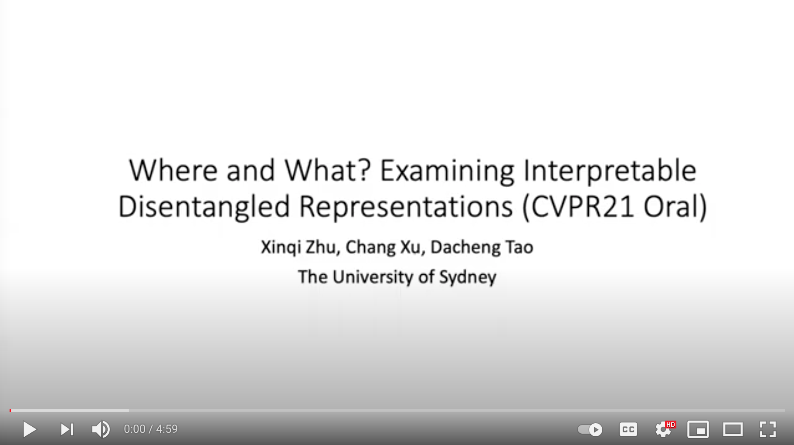

## Disentangled Semantic Variations on FFHQ Dataset


## Abstract

Capturing interpretable variations has long been one of the goals in
disentanglement learning. However, unlike the independence assumption,
interpretability has rarely been exploited to encourage disentanglement
in the unsupervised setting. In this paper, we examine the interpretability
of disentangled representations by investigating two questions:
where to be interpreted and what to be interpreted? A latent code is
easily to be interpreted if it would consistently impact a certain subarea
of the resulting generated image. We thus propose to learn a spatial mask
to localize the effect of each individual latent dimension. On the other
hand, interpretability usually comes from latent dimensions that capture
simple and basic variations in data. We thus impose a perturbation on a
certain dimension of the latent code, and expect to identify the
perturbation along this dimension from the generated images so that
the encoding of simple variations can be enforced. Additionally, we develop
an unsupervised model selection method, which accumulates perceptual
distance scores along axes in the latent space. On various datasets,
our models can learn high-quality disentangled representations without
supervision, showing the proposed modeling of interpretability is an
effective proxy for achieving unsupervised disentanglement.

## Video Presentation
[](https://youtu.be/iXAs2GnDp7g")

## Links

[Paper](https://arxiv.org/abs/2104.05622)

[Supplementary](../files/cvpr21_supp.pdf)

[Code](https://github.com/zhuxinqimac/PS-SC)

## Citation
```
@inproceedings{Xinqi_cvpr21,
author={Xinqi Zhu and Chang Xu and Dacheng Tao},
title={Where and What? Examining Interpretable Disentangled Representations},
booktitle={CVPR},
year={2021}
}
```
