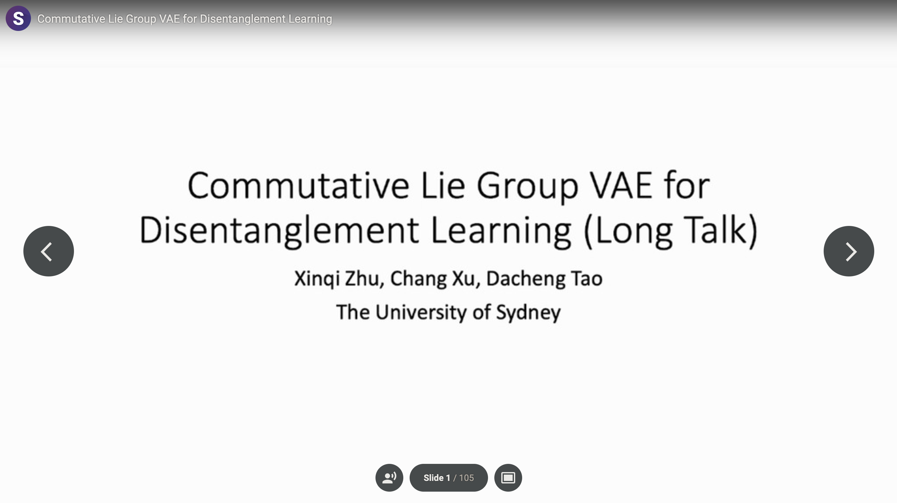

## Abstract

We view disentanglement learning as discovering an underlying structure that
equivariantly reflects the factorized variations shown in data.
Traditionally, such a structure is fixed to be a vector space with data
variations represented by translations along individual latent dimensions.
We argue this simple structure is suboptimal since it requires the model
to learn to discard the properties (e.g. different scales of changes,
different levels of abstractness) of data variations, which is an extra
work than equivariance learning. Instead, we propose to encode the data
variations with groups, a structure not only can equivariantly represent
variations, but can also be adaptively optimized to preserve the properties
of data variations. Considering it is hard to conduct training on group
structures, we focus on Lie groups and adopt a parameterization using
Lie algebra. Based on the parameterization, some disentanglement learning
constraints are naturally derived. A simple model named Commutative Lie Group
VAE is introduced to realize the group-based disentanglement learning.
Experiments show that our model can effectively learn disentangled
representations without supervision, and can achieve state-of-the-art
performance without extra constraints.

## Model Architecture


## Video Presentation
[](https://recorder-v3.slideslive.com/?share=38302&s=656ce8dd-35cd-4d7f-86c5-83d208e0e1dd)

## Links

[Paper](https://arxiv.org/abs/2106.03375)

[Supplementary](../files/icml21_supp.pdf)

[Code](https://github.com/zhuxinqimac/CommutativeLieGroupVAE-Pytorch)

## Citation
```
@inproceedings{Xinqi_liegroupvae_icml21,
author={Xinqi Zhu and Chang Xu and Dacheng Tao},
title={Commutative Lie Group VAE for Disentanglement Learning},
booktitle={ICML},
year={2021}
}
```
